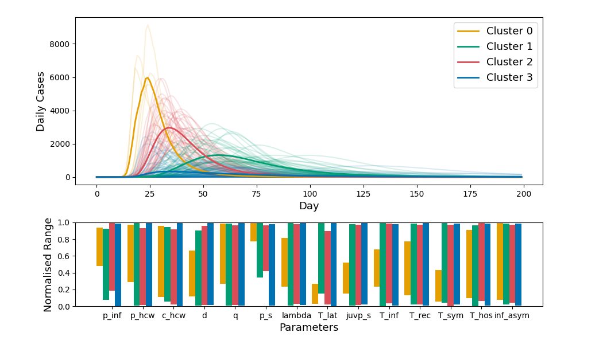
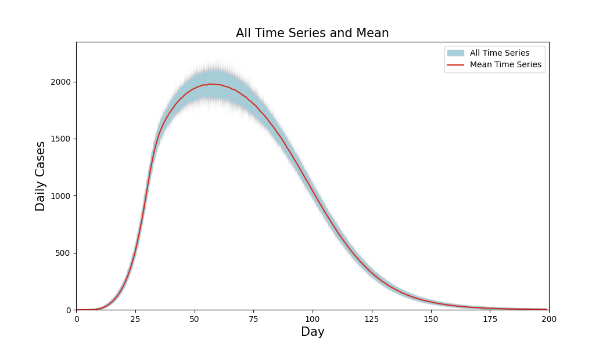
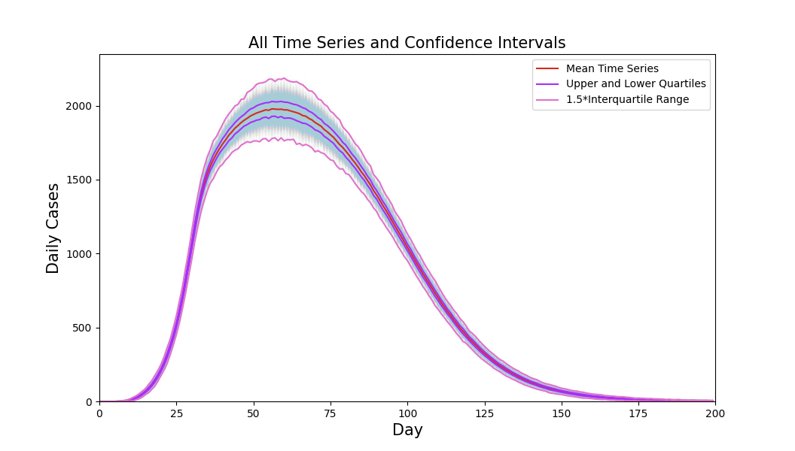

# sandu   [](https://opensource.org/licenses/MIT)

*High Level Sensitivity and Uncertainty (SandU) analysis tools for python.*

## *Sandu aims to provide high level functionality for sensitivity and uncertainty analysis.*

Sandu was developed to provide Sensitivity Analysis and Uncertainty Quantification functionality for the [rampvis-api](https://github.com/ScottishCovidResponse/rampvis-api).

## Installation

The package is named `sandu` and listed on [PyPI](https://pypi.org/project/sandu/). You can use the pip to install:

*Unix/MacOS*
```bash
python3 -m pip install sandu
```
*Windows*
```bash
py -m pip install sandu
```
## Description

The motivation is to provide easy to use, end to end, sensitivity analysis and uncertainty quantification functionality. Thereby lowering the barrier of entry for this type of analysis in python. Sandu was developed to analyse agent based models but may be applied more generally to any model or experimental data.

**Illustration of the package's raison d'être.**\
To implement [*Sobol sensitivity analysis*](https://en.wikipedia.org/wiki/Variance-based_sensitivity_analysis), using sandu, no direct integration with a model is needed. A selection of the model's parameter values and associated outputs is all you need. A [*Gaussian process emulator*](https://en.wikipedia.org/wiki/Gaussian_process_emulator) is trained on the input-output data, which then acts as a surrogate model. By sampling from the gaussian process emulator the Sobol sensitivity indices can be effectively estimated with fewer expensive model runs required. Usually, this process would involve different libraries and a substantial amount of code. However, when using sandu to perform this analysis one simply provides: a [pandas dataframe](https://pandas.pydata.org/docs/reference/api/pandas.DataFrame.html) with parameter-output data from the model, the names of the relevant columns in the data frame, and N which determines the number of samples drawn from the surrogate model. One then runs:

```
import pandas as pd
from sandu.sensitivity_analysis import sobol

Si_df = sobol.get_indices(df, parameters, bounds, quantity_mean, quantity_varaince, N)
```
Where, `Si_df` is a pandas dataframe with the first and total sensitivity indices. This is shown in detail, using example data, in `/examples/example_sobol.py`.

**Data Types**\
A *sensitivity input* class is included. This allows the user to bundle data needed for sensitivity analysis into objects which can be saved and loaded using JSON. While the use of sensitivity input objects is voluntary, they are included to ease the integration of the sensitivity analysis algorithms in a data processing pipeline. The advantages of using sensitivity input objects are illustrated in the variations (a)(b) of the Sobol analysis example (1.i).
## Contents

1. **Sensitivity Analysis Algorithms**
    1. **Sobol Sensitivity Analysis**
    2. **Cluster-based Sensitivity Analysis**
2. **Uncertainty Quantification Algorithms**
    1. **Mean Time Series**
    2. **Confidence Intervals**
3. **Data Types**
    1. **Sensitivity Input**
    2. **Uncertainty Input**
4. **Gaussian Process Emulator**


# Examples
**Model Data: Scalar or Time Series**\
*All sensitivity analysis algorithms in sandu work with both scalar and list as model outputs*. To analyse model outputs which are ordered lists of values, for example *time series*, one supplies a pandas dataframe of the same format as for scalar model outputs. The difference is that the model output cells of the dataframe contain list objects instead of scalars. 

In the examples folder, `sensitivity_input_list.json` contains a sensitivity input object with time series model output data, a time series equivalent of `/examples/sensitivity_input.json`. In all examples, changing the model output data used from times series to scalar and vice versa is possible by alternating between these files. Furthermore, changing `/parameters_output.csv` to `/parameters_output_list.csv` in `/examples/example_make_and_load_sensitivity_input.py` creates a sensitivity input object with time series model output data identical to `/examples/sensitivity_input_list.json`.
## (1.i) Computing Sobol Indices
Two examples of computing Sobol indices from the same data are included, (a) one where the data is read from a CSV and additional parameters supplied by hand and (b) one using a sensitivity input object to streamline the process.

(a) Running  `/examples/example_sobol.py` analyses the parameter sensitivities from `parameters_output.csv` and produces a plot which should appear as below.


(b) The same analysis is performed in `/examples/example_sobol_sensitivity_input.py` but using a sensitivity input object `sensitivity_input.json`, removing the need to specify the parameter names, bounds, etc. manually.

If the input data for Sobol index calculation have lists/time series for model outputs the default behaviour of `sobol.get_indices()` is to take the sum of the lists as the features for training and predicting using the gaussian process emulator. Alternative function mapping lists to scalars can be supplied with the `scalar_mean_function` and `scalar_variance_function` arguments. Alternatively one can modify the dataframe by hand to map the lists/time series to more involved scalar features of interest before passing it to `sobol.get_indices()`.
## (1.ii) Cluster-based Sensitivity Analysis
Clustering of model outputs, especially time series outputs, allows one visually judge the sensitivity to different parameters. Since, if a parameter takes similar values across clusters its impact on model behaviour is limited. In addition, cluster-based analysis allows a modeller to visualise how the sensitivity manifests on the output and what regions of parameter space is mapped to what model behaviour. Running `/examples/example_sensitivity_cluster_analysis.py` identifies clusters in the time series outputs stored in `/examples/sensitivity_input_list.json` and plots the clusters colour-coded, with the mean of each cluster overlaid, and also plots ranges of the parameters corresponding to each cluster, normalised to between 0 and 1 with the same colour scheme. This example should produce a plot as below.



Clustering, like all of sandu's methods, work with both lists/time series and scalars, changing `sensitivity_input_list.json` to `sensitivity_input.json` produces the same type of plot for scalar model outputs. It might be interesting to compare this example using `sensitivity_input.json`to the plot in the Sobol index example, which analyses the same model data 🙂.
## (2.i) Mean Time Series from Ensemble
An example of computing the mean time series from the ensemble of time series, and then plotting the entire ensemble with the mean overlaid is included in `/examples/example_mean_all_time_series.py`. Where the width and shape of the band formed by the ensemble members in relation to the mean line reveal uncertainty in the model predictions. The resulting plot should appear as below.



This example analyses the UncertaintyInput object stored in `uncertainty_input.json`, which contains the ensemble of time series in `uncertainty_example_data.csv` in addition to the metadata needed to parse this for uncertainty quantification. Forming an UncertaintyInput from `uncertainty_example_data.csv` is shown in `/examples/example_make_and_load_sensitivity_input.py`.
## (2.ii) Confidence Intervals from Ensemble
Sandu can calculate confidence intervals based on interquartile range IQR, at each time step for an ensemble of time series. The example in `/examples/example_confidence_intervals.py` shows how this may be done and produces a plot as below.

This example, just like example (2.i), analyses the UncertaintyInput object stored in `uncertainty_input.json`.
## (3.i) Creating and Saving a Sensitivity Input Object
A *sensitivity input object* is an object which contains all the information needed to perform sensitivity analysis. It is not necessary to use sensitivity input objects as the two examples of calculating Sobol sensitivity show.
This means that in addition to the parameter-output data, a sensitivity input object contains the names and bounds of the parameters of the model in question and the name of the model output and output variance.
Sensitivity input objects can be stored using JSON and allows all the input data needed for sensitivity analysis to be stored in one place. 
An example of creating, saving and loading a sensitivity input object is found in `/examples/example_make_and_load_sensitivity_input.py`, which creates a sensitivity input object from `uncertainty_example_data.csv` and saves it to `new_uncertainty_input.json`.

## (3.ii) Creating and Saving an Uncertainty Input Object
A *uncertainty input object* is an object which contains the data needed by uncertainty quantification algorithms. These objects are the uncertainty quantification counterpart of *sensitivity input objects*. Thus, allowing one to apply any uncertainty quantification algorithm to the same data easily. 
An example of creating, saving and loading a uncertainty input object is found in `/examples/example_make_and_load_uncertainty_input.py`, which creates a sensitivity input object from `parameters_output.csv` and saves it to `new_sensitivity_input.json`.
## (4) Training and evaluating a Gaussian Process Emulator. 
Running `/example/example_gaussian_process_emulator.py` trains a model on `parameters_output.csv` and plot the models test set performance. It should produce a plot as below.


# Credits

* [SALib](http://salib.github.io/SALib/)
* [scikit-learn](https://scikit-learn.org/stable/)
