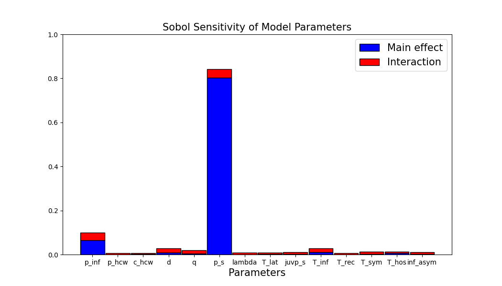
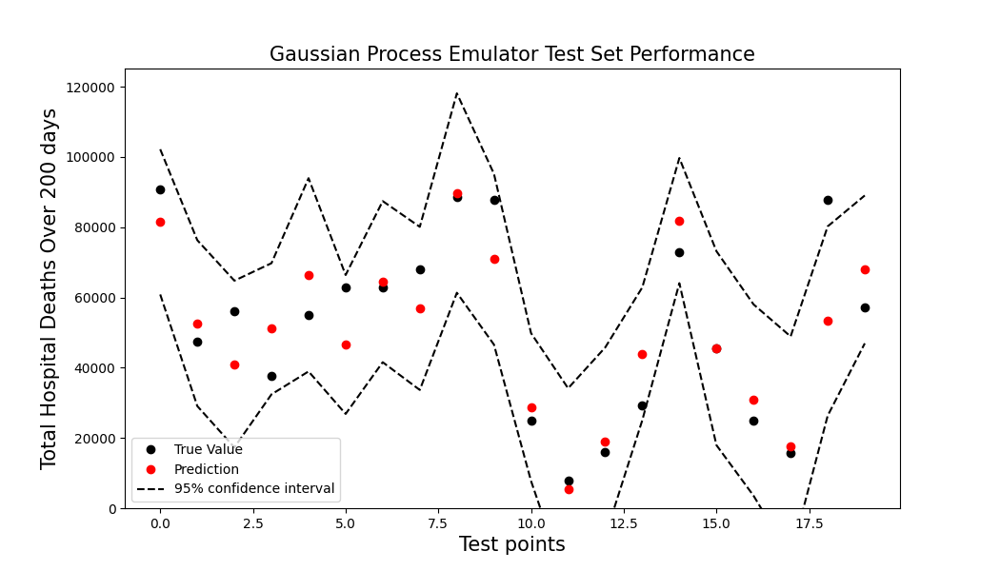

# Sobol_Sensitivity

Tools to Perform Sobol Sensitivity Analysis on Mathematical Model using a Gaussian Process Emulator.


## Description
Avoids performing [*Sobol sensitivity analysis*](https://en.wikipedia.org/wiki/Variance-based_sensitivity_analysis) directly on the model in question, as models often are expensive to evaluate. Instead, a statistical surrogate model is created from samples of the original models inputs and outputs. The statistical surrogate model is created using a [*Gaussian process emulator*](https://en.wikipedia.org/wiki/Gaussian_process_emulator). Sobol sensitivity  analysis is then performed on the surrogate model to obtain the first order (S1) and total order (ST) sensitivity indices.

## Contents
* Implementation of Sobol sensitivity analysis using a Gaussian process emulator: `sensitivity_analysis_sobol.py`.
* Methods of training and making predictions using a a Gaussian Process emulator: `gaussian_process_emulator.py`.
* An example data file  containing the inputs and ouputs of an agent based model: `parameters_output.csv`.
* Example of how to extract Sobol sensitivities: `example_sobol.py`.
* Example of how to train and test a Gaussian process emulator: `example_gaussian_process_emulator.py`.
* Method to convert data with an esoteric structure (See bottom of README) to CSV: `esoteric_data_to_CSV.py`.

# Examples
Examples of (1) how to extract Sobol indices of a model from data and of (2) how to train and evaluate a Gaussian Process Emulator are provided. 

(1) Running `example_sobol.py` analyses the parameter sensitivities  from `parameters_output.csv` and displays a plot which should appear as below:



(2) Running `example_gaussian_process_emulator.py` trains a model on `parameters_output.csv` and plot the models test set performance. It should produce a plot as below:



**Esoteric Data Extraction**
---
While superfluous to most users, `esoteric_data_to_CSV.py` is included specifically to parse data with the following structure.
```
    ├───UQ_eera_2020-09-11_part1
    │   ├───output_row_0
    │   │    └───output_prediction_simu_...
    │   ├───output_row_1
    │   │    └───output_prediction_simu_...
    │   ...
    ...
```
To extract data from this type of structure and generate a CSV file which can be studied use:
```
from esoteric_data_to_CSV import create_CSV_from_esoteric_data

create_CSV_from_esoteric_data("NAME_OF_OUTPUT_FILE.csv")
```
